# Post-Production Workflow Manager

## Introduction
Post-production in filmmaking, video production, and content creation involves multiple stages—editing, color correction, sound design, VFX, and final delivery. Managing these processes efficiently is challenging due to scattered files, tight deadlines, and team collaboration issues. The **Post-Production Workflow Manager** streamlines these workflows, offering task management, collaboration tools, file tracking, and cloud integration.

## Features
### Core Features
- **Project & Task Management**: Organize projects, tasks, and subtasks with deadlines and priorities.
- **Kanban Board**: Visual task tracking and management.
- **To-Do Lists & Scheduling**: Assign tasks, set deadlines, and track progress.
- **Metadata Validator**: Ensure file metadata consistency.
- **Preview to Timeline**: View media files in a timeline-based preview.
- **Screenwriting Module**: Built-in scriptwriting tools with real-time collaboration.
- **Version Control & Rollback**: Track file versions and restore previous iterations.
- **Cloud Integration**: Access media files via Google Drive, Dropbox, or dedicated storage.
- **In-App Chat & Feedback**: Seamless communication and approval workflows.

### Future Enhancements
- **AI-Assisted Editing**: Automate repetitive tasks using AI.
- **Cloud Rendering Support**: Integrate with cloud rendering services.
- **Advanced Reporting & Analytics**: Gain insights into project efficiency.
- **Mobile App**: Manage workflows on the go.
- **Integration with Third-Party Tools**: Adobe Premiere, Final Cut Pro, DaVinci Resolve.

## Tech Stack
### Backend (Spring Boot + MongoDB)
- **Spring Boot**: REST API framework.
- **MongoDB**: NoSQL database for flexible document storage.
- **Maven**: Dependency management.
- **Spring Security + JWT**: Authentication and authorization.

### Frontend (React + Vite + TypeScript)
- **Vite**: Fast development server.
- **React.js**: Component-based UI.
- **TypeScript**: Static typing for reliability.
- **Tailwind CSS**: Modern styling.
- **React Router**: Client-side routing.
- **Axios**: API communication.

### Deployment & Hosting
- **Docker**: Containerized deployment.
- **AWS/GCP/Azure**: Cloud-based hosting.
- **CI/CD (GitHub Actions, Jenkins)**: Automated builds and deployment.

## User Flow
### 1. Login Page
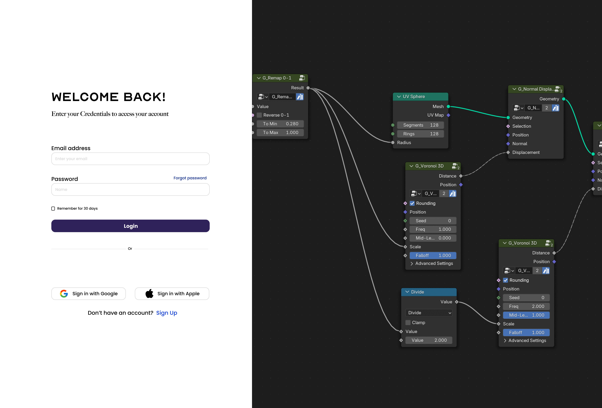
Users enter credentials to authenticate.

### 2. Register Page
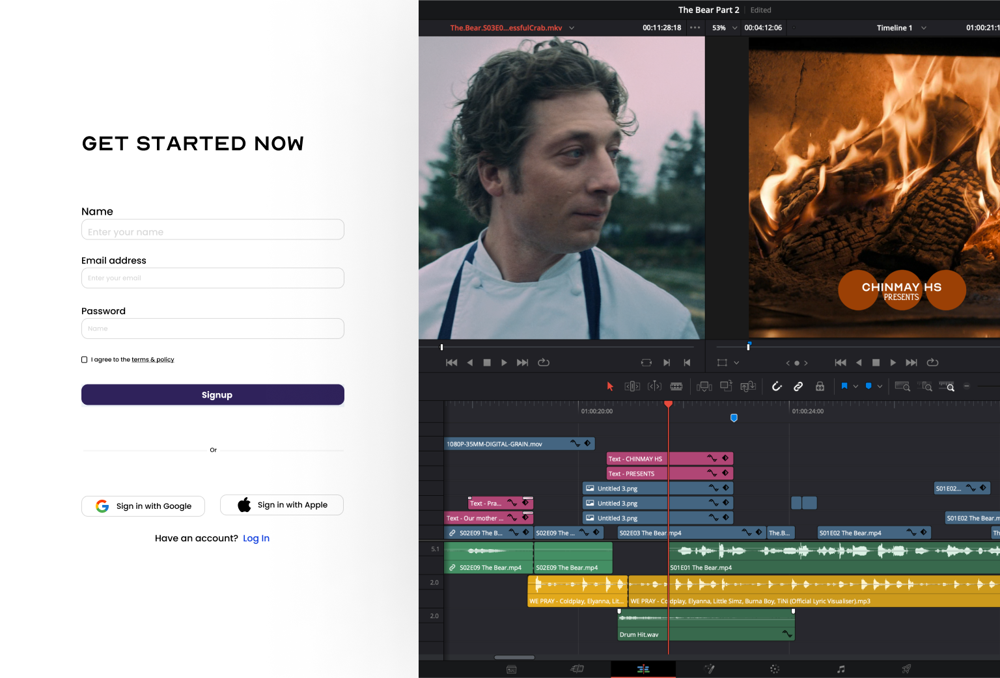
New users can sign up and create an account.

### 3. Project Creation
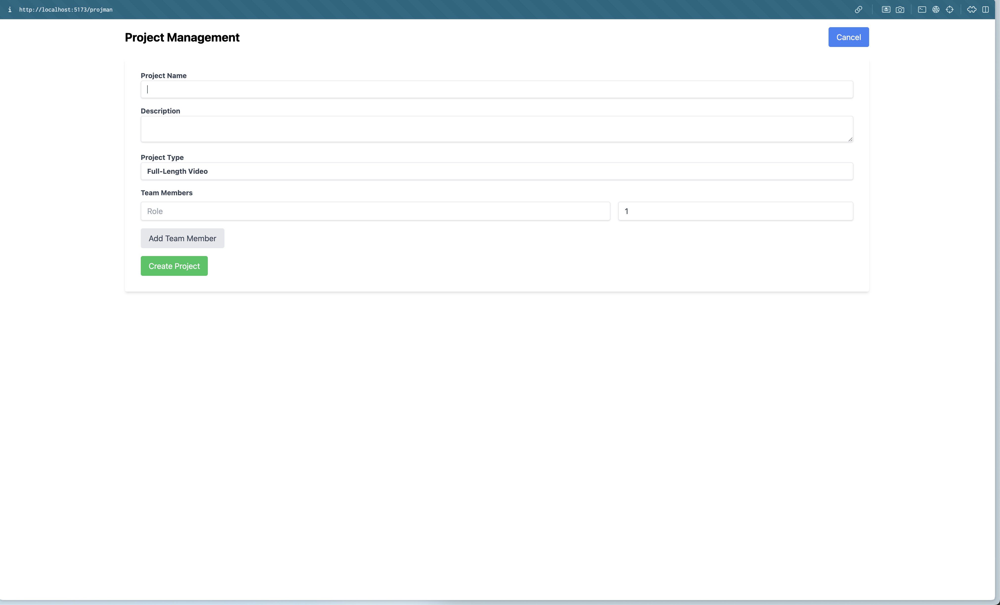
Users create projects with teams and workflow settings.

### 4. Dashboard
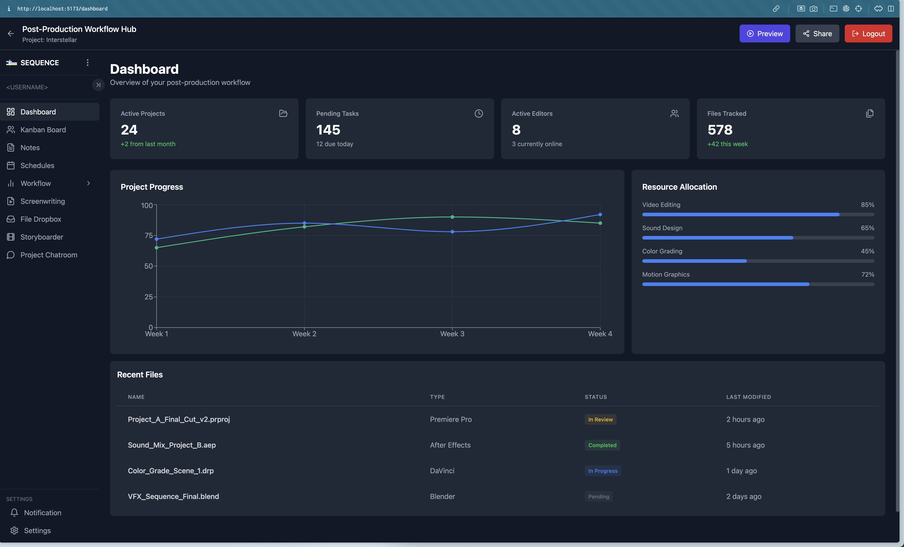
An overview of all projects, progress tracking, and notifications.

### 5. Kanban Board
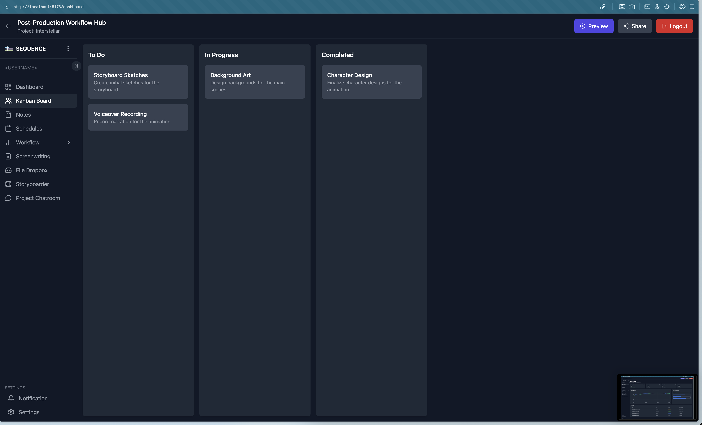
Drag-and-drop task management within the post-production pipeline.

### 6. Scheduling
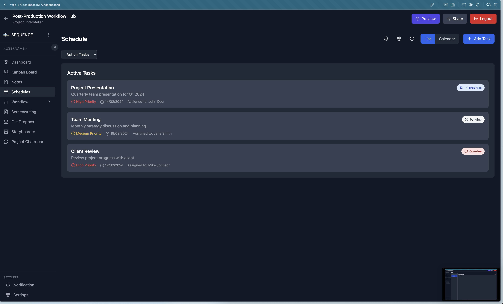
Manage and assign deadlines to optimize post-production timelines.

### 7. Notes Section
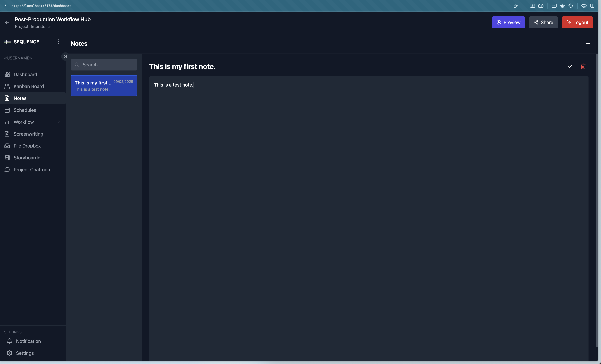
Attach notes, feedback, and important details to tasks and files.

### 8. Project Dropbox 1
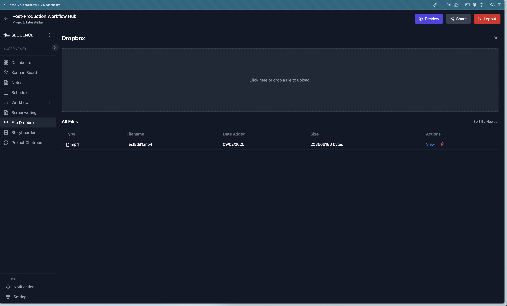
Organized file storage and version control.

### 9. Project Dropbox 2
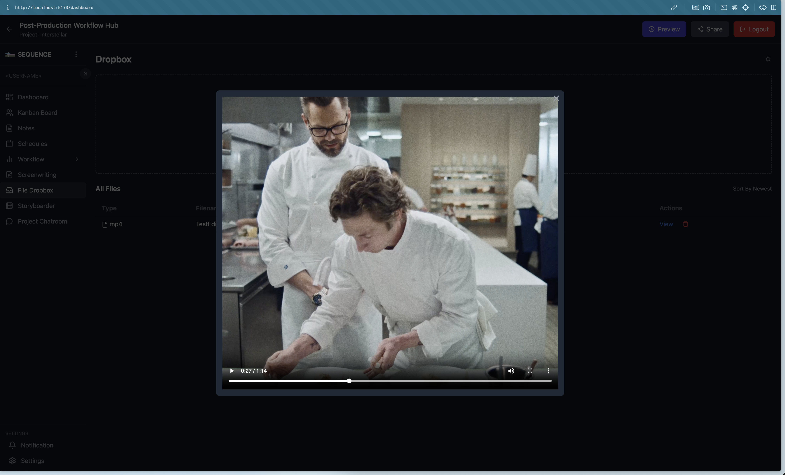
Second-tier file management for archived or reference materials.

### 10. Project Reference 1
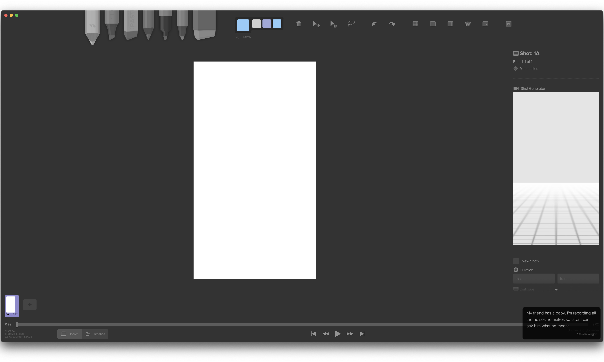
Reference for a storyboarding tab.

### 11. Project Reference 2
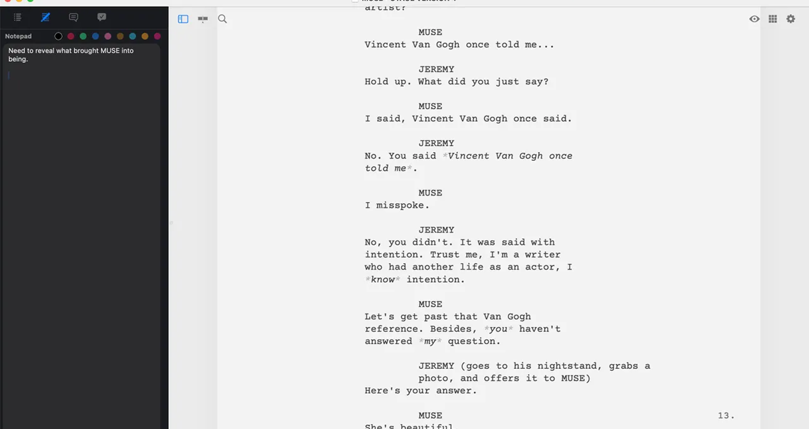
Reference for a screenwriting tab.

## Project Structure
```bash
post-production-workflow/
│── backend/         # Spring Boot + MongoDB API
│── frontend/        # Vite + React + TypeScript UI
│── assets/          # Image & media files
│── docs/            # Documentation files
│── README.md        # Project documentation
```

## Backend Components
### 1. Config Files
Handles CORS, security, and MongoDB connection.

### 2. Controllers
Defines API endpoints for projects, tasks, users, authentication, etc.

### 3. DTO (Data Transfer Object)
Ensures secure and structured data communication between frontend and backend.

### 4. Entities
Defines the MongoDB schema for users, projects, tasks, etc.

### 5. Enums
Stores predefined constant values like task status (TODO, IN-PROGRESS, DONE).

### 6. Repository
Handles database queries using Spring Data MongoDB.

### 7. Service
Business logic layer connecting controllers to repositories.

## API Documentation
### Authentication
- **POST /api/auth/login** - User login.
- **POST /register** - User registration.
- **POST /api/auth/logout** - Logout user.

### Project Management
- **POST /api/projects** - Create a new project.
- **GET /api/projects/{id}** - Fetch project details.
- **PUT /api/projects/{id}** - Update project.
- **DELETE /api/projects/{id}** - Delete project.

### Task Management
- **POST /api/projectmanagement/{id}/schedule** - Create a task.
- **GET /api/projectmanagement/{id}/schedule** - Get task details.
- **PUT /api/projectmanagement/{id}/schedule** - Update task.
- **DELETE /api/projectmanagement/{id}/schedule** - Remove task.

## API Testing & Errors
### HTTP Methods
- **GET**: Retrieve data.
- **POST**: Create new resources.
- **PUT**: Update existing data.
- **DELETE**: Remove data.

### Common Errors
- **400 Bad Request**: Invalid request payload.
- **401 Unauthorized**: Authentication required.
- **403 Forbidden**: Insufficient permissions.
- **404 Not Found**: Requested resource does not exist.
- **500 Internal Server Error**: Unexpected server failure.

## Why MongoDB?
- **Schema Flexibility**: Ideal for storing diverse post-production data.
- **Scalability**: Easily handles high-volume data operations.
- **Fast Queries**: Optimized for document-based retrieval.
- **Better for Media & Metadata Storage**: Efficiently stores media metadata, project files, and task information.

## Installation & Setup

### Quick Start (Run Both Frontend & Backend)
```sh
# Install frontend dependencies
npm run install:all

# Run both frontend and backend simultaneously
npm run dev
```

### Individual Setup
#### Backend Setup
```sh
cd server
mvn clean install
mvn spring-boot:run
```

#### Frontend Setup
```sh
cd client
npm install
npm run dev
```

## Deployment with Docker
```sh
docker-compose up --build
```

## Conclusion
This Post-Production Workflow Manager optimizes post-production processes, providing an integrated, scalable, and secure solution. Future enhancements will continue to expand its capabilities, making it a vital tool for filmmakers and content creators.

